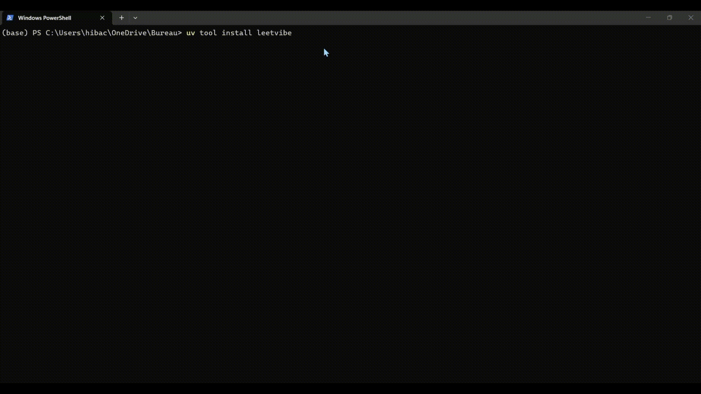
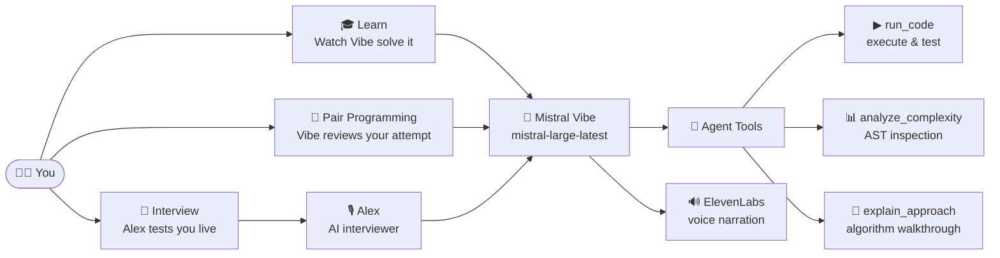
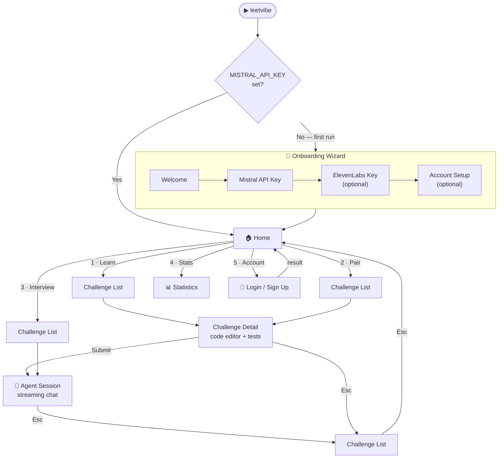
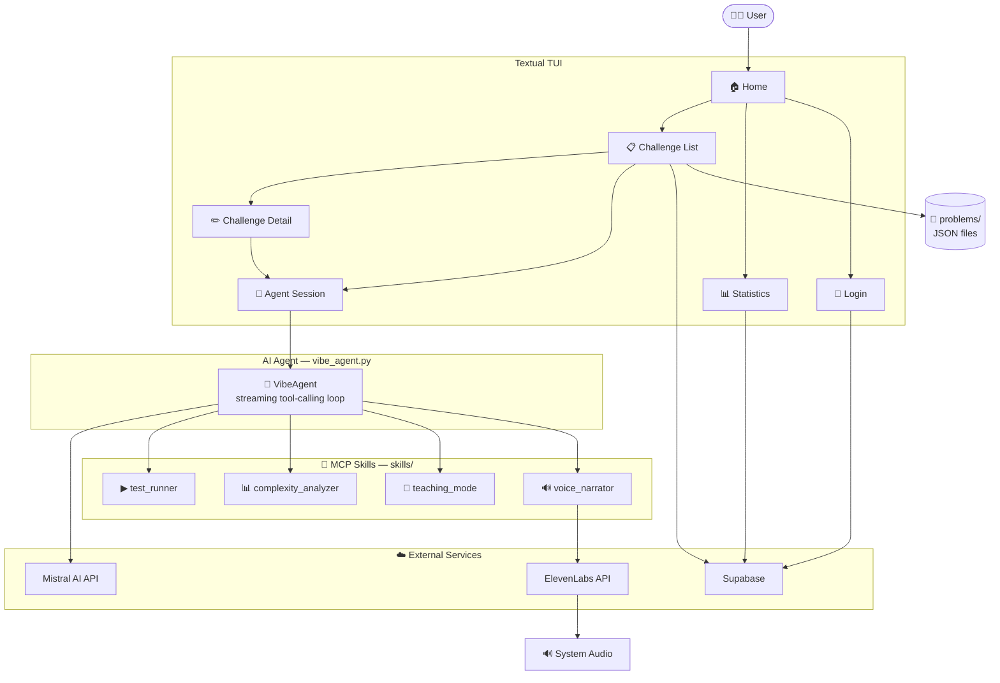
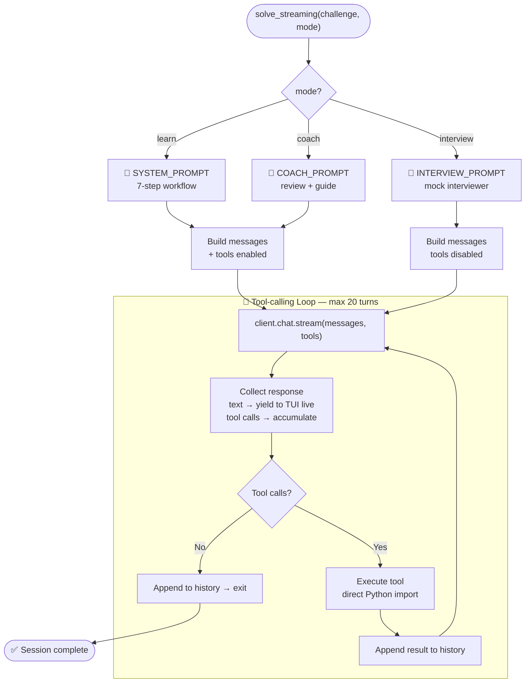
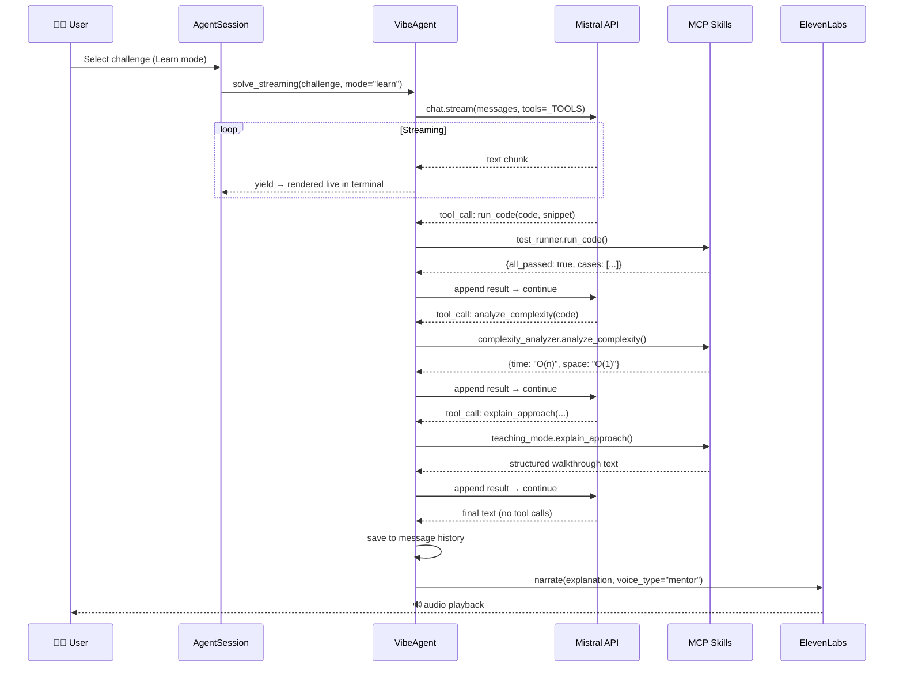
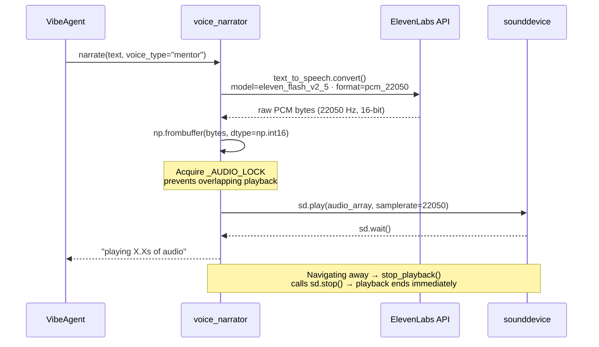

# 🎯 LeetVibe

> **Your AI pair programmer for LeetCode — powered by Mistral Vibe**

Stop grinding alone. LeetVibe puts a senior engineer in your terminal who can teach, coach, or interview you — depending on how much help you want today.

---

## 🎬 Demo

### Full App Demo

[](https://www.youtube.com/watch?v=VIDEO_ID)

> Click the thumbnail to watch the full demo on YouTube.

### ⚙️ Onboarding Setup



---

## 🧠 How It Works

LeetVibe is built on **Mistral Vibe** — an autonomous AI agent that doesn't just answer questions, it reasons, runs code, measures complexity, and explains its thinking step by step. Every session is a live conversation: you can ask follow-up questions, push back, or go deeper at any point.

**Three modes. Three different relationships with the AI.**



---

## 🎓 Learn Mode

*"Teach me how to solve this."*

Mistral Vibe takes the wheel. It walks through the problem using a strict **7-step workflow** — reasoning out loud, running real code, and narrating every decision. You watch, listen, and absorb.

| Step | What Vibe Does |
|------|---------------|
| 1️⃣ Understand | Restates the problem, identifies edge cases and algorithm family |
| 2️⃣ Brute Force | Writes the simplest correct solution and runs it against test cases |
| 3️⃣ Analyse | Calls `analyze_complexity` — "This is O(n²) because of the nested loops" |
| 4️⃣ Key Insight | Names the one idea that eliminates the bottleneck |
| 5️⃣ Optimal | Writes the optimised solution and validates it with `run_code` |
| 6️⃣ Compare | "We improved from O(n²) → O(n) by eliminating redundant lookups" |
| 7️⃣ Walkthrough | Calls `explain_approach` for a structured pattern breakdown |

> Vibe never skips a step, even for trivial problems. If a test fails, it debugs and fixes before moving on.

---

## 🤝 Pair Programming Mode

*"Review my attempt and guide me to the optimal."*

You write first. Vibe reviews. It follows a **6-step coaching workflow** designed to push you toward the answer — not hand it to you.

| Step | What Vibe Does |
|------|---------------|
| 1️⃣ Test | Runs your code: "Your solution passes 3/5 test cases" |
| 2️⃣ Diagnose | Points to exact lines — bugs, inefficiencies, edge case gaps |
| 3️⃣ Analyse | Measures your complexity: "Your solution is O(n²) because..." |
| 4️⃣ Hint | Nudges without revealing: "What data structure gives O(1) lookup?" |
| 5️⃣ Optimal | Only now reveals the full solution with line-by-line explanation |
| 6️⃣ Compare | Side-by-side: your approach vs optimal, with the key insight named |

---

## 🎤 Interview Mode

*"Test me like it's a real interview."*

Meet **Alex** — a senior software engineer who conducts 30-minute mock technical interviews. No hints unless you're stuck. No code written for you. Just a realistic conversation.

**Alex's rules:**
- 🤝 Greets you once, states the problem, asks for your approach
- 🔍 Probes with *"What's the time complexity?"* / *"Any edge cases?"* / *"Can you do better?"*
- 💡 Gives **one small hint** if you're stuck, then waits
- ✅ Closes with brief feedback on correctness, complexity, and one thing to improve
- 🔇 Never re-introduces himself on follow-up turns
- 🚫 Never writes code, never reveals the optimal solution unprompted

His opening monologue plays as speech via ElevenLabs so the session feels live from the first second.

---

## 🆚 Mode Comparison

| | 🎓 Learn | 🤝 Pair Programming | 🎤 Interview |
|---|---|---|---|
| Who codes first | Vibe | You | — (verbal only) |
| Tools enabled | ✅ run_code, complexity, explain | ✅ run_code, complexity, explain | ❌ none |
| Voice narration | ✅ auto after each step | ✅ on demand | ✅ opening monologue |
| Follow-up chat | ✅ | ✅ | ✅ |
| Gives hints | — | ✅ Socratic nudges | ✅ one hint only |
| Reveals optimal | ✅ always | ✅ after coaching | ❌ never |
| Response length | Long — full explanations | Long — detailed review | Short — 2–4 sentences |

---

## ✨ More Features

- 📚 **Challenge browser** — filter by difficulty, topic, or solved status; free-text search across hundreds of LeetCode problems
- ✏️ **Inline code editor** — write Python in the terminal with syntax highlighting and run it against the problem's test cases without leaving the app
- 📋 **Live test results** — pass/fail output per test case shown immediately
- 💡 **Solution tab** — reference solutions when they exist in the problem data
- 📊 **Statistics screen** — session counts, solved problem tracking, progress over time
- ☁️ **Cloud sync** — optional account (email/password or Google OAuth) to persist progress across machines
- 🧙 **Onboarding wizard** — first-run setup collects API keys and account details interactively; nothing to configure by hand

---

## 🚀 Getting Started

### Install from PyPI

Requires **Python 3.11+**.

```bash
# with uv (recommended)
uv tool install leetvibe

# with pip
pip install leetvibe
```

```bash
leetvibe
```

The onboarding wizard opens automatically on first launch. It will ask for your **Mistral API key** (required) and optionally your **ElevenLabs key** for voice narration. Keys are saved to `~/.leetvibe/.env` and never touched again.

- 🔑 Get a Mistral key: https://console.mistral.ai
- 🔊 Get an ElevenLabs key: https://elevenlabs.io *(optional)*

---

### Install from Source

**Requirements:** Python 3.11+, [uv](https://docs.astral.sh/uv/)

```bash
git clone https://github.com/hibachaabnia/leetvibe.git
cd leetvibe
uv sync
uv run leetvibe
```

For local development, copy `.env.exemple` to `.env` and fill in your keys:

```
MISTRAL_API_KEY=your_key_here
ELEVENLABS_API_KEY=your_key_here   # optional
```

---

## 🗺️ Navigation



**Keyboard shortcuts:**

| Key | Action |
|-----|--------|
| `1`–`6` | Home screen quick-select |
| `Enter` | Open / confirm |
| `Esc` | Go back |
| `Ctrl+D` | Toggle description panel (+ Alex's opening in Interview) |
| `Ctrl+V` | Toggle voice narration |
| `Ctrl+C` | Copy last code block |
| `Ctrl+Q` | Quit from anywhere |

---

## 🏗️ Architecture



**Project layout:**

```
leetvibe/
├── cli.py                    Entry point
├── config.py                 Loads config.yaml + .env
├── vibe_agent.py             Mistral agent — streaming tool-calling loop
├── challenge_loader.py       Reads problem JSONs from problems/
├── code_runner.py            Sandboxed Python test execution
├── cloud/
│   ├── auth.py               Supabase auth (email + Google OAuth)
│   └── db.py                 Cloud sync — solved slugs, sessions
└── textual_ui/
    ├── screens/              home, challenge_list, challenge_detail,
    │                         agent_session, stats, login
    └── widgets/              banner, challenge_table, status_bar

skills/
├── test_runner/              Execute code against test cases
├── complexity_analyzer/      AST-based O(n) analysis
├── teaching_mode/            Algorithm pattern explanations
└── voice_narrator/           ElevenLabs TTS playback

problems/
├── easy/ · medium/ · hard/   Challenge JSON files
```

---

## ⚙️ How Mistral Vibe Powers LeetVibe

Every session runs through `VibeAgent` — a hand-rolled tool-calling loop built directly on Mistral's streaming API. No LangChain, no wrappers. Just raw streaming with full control over what renders in the terminal.

### The Agent Loop



### System Prompts

Each mode gets a completely different personality baked into the system prompt:

- 📜 **`SYSTEM_PROMPT`** — instructs Vibe to follow the 7-step workflow exactly, think out loud before every code block, and never skip a step even for trivial problems. Uses Rich markup (`[bold]`, `[dim]`) rendered directly by Textual.
- 📜 **`COACH_PROMPT`** — instructs Vibe to test the user's code first, be specific about buggy lines, give Socratic hints before revealing anything, and frame all feedback as encouragement.
- 📜 **`INTERVIEW_PROMPT`** — instructs Alex to speak in 2–4 sentences only, never re-introduce himself, never write code, and give exactly one hint when the candidate is stuck. Tool calls are **disabled entirely** in this mode.

### Agent Tools

| 🔧 Tool | Skill | What It Does |
|---------|-------|-------------|
| `run_code` | `test_runner` | Executes Python code against test cases in a sandboxed namespace with stdlib pre-imported. Returns pass/fail per case. |
| `analyze_complexity` | `complexity_analyzer` | Walks the AST — counts loop nesting depth, detects sorting calls, memoization decorators, and dynamic allocations. Returns `{time, space, explanation}`. |
| `explain_approach` | `teaching_mode` | Generates a structured 6-step walkthrough for 15+ algorithm patterns (two-pointer, DP, sliding window, BFS, heap, trie…). |

### Full Session Flow



---

## 🔊 How ElevenLabs Powers the Voice

Voice narration is handled by the `voice_narrator` skill. It converts text to raw PCM audio via ElevenLabs and plays it directly through `sounddevice` — no ffmpeg required.

### Voice Personas

| Persona | Voice | Used In |
|---------|-------|---------|
| `mentor` | Sarah | Learn — calm, instructive |
| `coach` | Adam | Pair Programming — encouraging |
| `excited` | Elli | High-energy moments |

### Audio Pipeline



**Two playback modes:**
- 🔄 `narrate()` — fires a background thread, returns immediately. Used during agent tool loops so the AI keeps going while audio plays.
- ⏸️ `narrate_blocking()` — blocks until audio finishes. Used for Alex's interview opening so the session feels live before you type.

---

## 🔐 Auth Flow

Optional cloud account to sync your progress. Two sign-in methods via Supabase:

```mermaid
sequenceDiagram
    participant User
    participant App as LeetVibe TUI
    participant Auth as cloud/auth.py
    participant Supabase
    participant Browser
    participant Pages as GitHub Pages (OAuth relay)

    rect rgb(30, 30, 60)
        Note over User,Supabase: 📧 Email / Password
        User->>App: Enter email + password
        App->>Auth: sign_in(email, password)
        Auth->>Supabase: auth.sign_in_with_password()
        Supabase-->>Auth: {access_token, refresh_token}
        Auth->>Auth: save → ~/.leetvibe/session.json
        Auth-->>App: AuthResult(ok=True)
    end

    rect rgb(20, 50, 30)
        Note over User,Pages: 🌐 Google OAuth
        User->>App: Click "Sign in with Google"
        App->>Auth: start_google_auth()
        Auth->>Auth: bind ephemeral port on 127.0.0.1
        Auth->>Supabase: sign_in_with_oauth(provider="google")
        Supabase-->>Auth: OAuth URL
        Auth->>Auth: start one-shot HTTP callback server
        App->>Browser: open OAuth URL
        User->>Browser: complete Google sign-in
        Browser->>Pages: redirect with tokens
        Pages->>Auth: POST → http://127.0.0.1:{port}/result
        Auth->>Supabase: set_session(tokens)
        Auth->>Auth: save → ~/.leetvibe/session.json
        Auth-->>App: AuthResult(ok=True)
    end
```



---

## 🔧 Configuration

`config.yaml` (committed — no secrets):
```yaml
mistral:
  model: "mistral-large-latest"

elevenlabs:
  voice_id: "EXAVITQu4vr4xnSDxMaL"
  enabled: true
```

`~/.leetvibe/.env` (created by the wizard — never committed):
```
MISTRAL_API_KEY=your_key
ELEVENLABS_API_KEY=your_key    # optional
```

The config loader checks `~/.leetvibe/.env` → project `.env` → environment variables, in that order.

---

## 📦 Dependencies

| Package | Purpose |
|---------|---------|
| `mistralai` | Mistral AI SDK — streaming chat + tool calling |
| `elevenlabs` | Text-to-speech |
| `textual` | Terminal UI framework |
| `sounddevice` + `numpy` | PCM audio playback |
| `supabase` | Auth + cloud sync |
| `mcp` | MCP skill server infrastructure |
| `python-dotenv` · `pyyaml` | Config loading |
| `click` | CLI entry point |
| `rich` | Terminal formatting |

---

## 📄 License

MIT © 2026 Hiba Chaabnia
