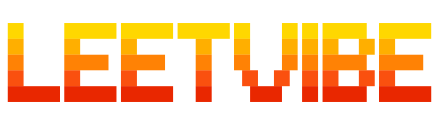

<div align="center">
  <a href="https://hiba-chaabnia.github.io/LeetVibe/">
    
  </a>

  <h3>Your AI pair programmer for LeetCode — a senior engineer in your terminal.</h3>

  <p>
    <a href="https://pypi.org/project/leetvibe/"></a>
    <a href="https://pepy.tech/project/leetvibe"></a>
    <a href="https://pypi.org/project/leetvibe/"></a>
    <a href="LICENSE"></a>
  </p>

  <p>
    <a href="https://hiba-chaabnia.github.io/LeetVibe/"><strong>Website</strong></a> ·
    <a href="#-quickstart">Quickstart</a> ·
    <a href="#-the-three-ai-modes">Modes</a> ·
    <a href="#-the-playbook">Playbook</a> ·
    <a href="#-under-the-hood">Under the Hood</a> ·
    <a href="#-faq--troubleshooting">FAQ</a>
  </p>
</div>


## 🔥 Why LeetVibe

Grinding LeetCode alone is slow, and pasting problems into a chatbot either hands you the answer or loses the thread entirely. LeetVibe is a different kind of study partner:

- ⚡ **It doesn't just talk — it executes.** The agent writes real code and runs it against the problem's test cases, then inspects the AST to gauge Big-O complexity and reasons about whether that estimate actually holds before it says "this is O(n²) because of the nested loops."
- 🎭 **Three relationships, one goal.** Have it *teach* you a full solution step by step, *coach* you on your own attempt without spoiling the answer, or *interview* you out loud like it's the real thing.
- 💻 **Terminal native.** No browser tabs, no copy-paste loop. Browse 2,800+ problems, write code, run tests, and talk to the agent — all in one TUI.

## 🚀 Quickstart

Requires **Python 3.11+**.

```bash
# with uv (recommended)
uv tool install leetvibe

# or with pip
pip install leetvibe
```

```bash
# first launch opens the onboarding wizard
leetvibe
```

The wizard asks for your **Mistral API key** and an **ElevenLabs key** for interview voice narration. Keys are saved to `~/.leetvibe/.env`.

- 🔑 Get a Mistral key: https://console.mistral.ai
- 🔊 Get an ElevenLabs key: https://elevenlabs.io *(optional)*


<details>
<summary><strong>Install from source</strong></summary>

Requires Python 3.11+ and [uv](https://docs.astral.sh/uv/).

```bash
git clone https://github.com/Hiba-Chaabnia/LeetVibe.git
cd LeetVibe
uv sync
uv run leetvibe
```

For local development, copy `.env.example` to `.env` and fill in your keys:

```
MISTRAL_API_KEY=your_key_here
ELEVENLABS_API_KEY=your_key_here   # optional
```

</details>

## 🎯 The Three AI Modes

Every session is a live conversation — ask follow-up questions, push back, or go deeper at any point. The three modes differ in one thing: **how much help you want today.**

> [!IMPORTANT]
> **Prefer no AI in the loop?** A fourth mode, **Practice**, skips the agent entirely — browse problems, write code, run tests, pull up hints, and read the built-in solution and explanation on your own. It's always available; the three modes below need a Mistral key, which is optional — skip it during onboarding and Practice is the only mode you'll see until you add one from **AI Settings** in the main menu.

### 🎓 Learn — *"Teach me how to solve this."*

Vibe takes the wheel. It works through the problem in a strict 7-step workflow — reasoning out loud, running real code, and explaining every decision while you watch and absorb:

- Starts from the **brute force**, runs it, and names its complexity — so you see *why* the optimal exists, not just what it is.
- Identifies the **one key insight** that eliminates the bottleneck, then writes and validates the optimal solution.
- Closes with a crisp synthesis paragraph: the core insight, the journey, the final complexity.
- Ends by coining a one-line **algorithm mnemonic** — a tiny analogy that makes the pattern's mechanics stick.

<details>
<summary>The full 7-step Learn workflow</summary>

| Step | What Vibe Does |
|------|---------------|
| 1. Understand | Summarises the task in one sentence, identifies edge cases and the key constraint |
| 2. First Pass | Writes the simplest correct solution and runs it against test cases |
| 3. Spot the Bottleneck | Calls `analyze_complexity` — "This is O(n²) because of the nested loops" |
| 4. The Insight | Names the single observation that unlocks a faster approach |
| 5. Optimize | Writes the optimised solution and validates it with `run_code` |
| 6. Measure the Gain | Calls `analyze_complexity` again — "We improved from O(n²) → O(n)" |
| 7. Takeaway | A crisp 4–6 sentence takeaway plus one open question, inviting a follow-up chat |

Vibe never skips a step, even for trivial problems — if the brute force is already optimal, it says so honestly instead of inventing a fake improvement. If a test fails, it debugs and fixes before moving on.

</details>

### 🤝 Pair Programming — *"Review my attempt and guide me to the optimal."*

You write first. Vibe reviews — and it's designed to push you toward the answer, not hand it to you:

- Runs your code and reports exactly what passed: *"Your solution passes 3/5 test cases."*
- Diagnoses precise lines — bugs, inefficiencies, missed edge cases — and measures *your* complexity.
- Nudges with Socratic hints (*"What data structure gives O(1) lookup?"*) before revealing anything.
- Only then shows the optimal, side by side with your approach, and names the improvement.


<details>
<summary>The full 7-step pair programming workflow</summary>

| Step | What Vibe Does |
|------|---------------|
| 1. Run Your Code | Runs your attempt against the real test cases and interprets the pass/fail split |
| 2. Diagnose | Points to exact lines — bugs, inefficiencies, edge case gaps |
| 3. Your Complexity | Measures your complexity: "Your solution is O(n²) because..." |
| 4. Bridge the Gap | Narrates the hint-to-reveal chain: the bottleneck, the unlocking question, and its answer |
| 5. Optimize | Reveals the full solution with line-by-line explanation (or, if yours was already optimal, polish and alternatives instead) |
| 6. Compare | Side-by-side: your approach vs optimal, complexity improvement named |
| 7. Takeaway | Crisp paragraph — core insight, what changed, final complexity — plus one open question |

</details>

### 🎤 Interview — *"Test me like it's a real interview."*

Meet **Alex** — a senior engineer who conducts 30-minute mock technical interviews. His opening monologue plays as voice via ElevenLabs, so the session feels live from the first second.

- States the problem once, then asks for *your* approach — and probes: *"What's the time complexity?" "Any edge cases?" "Can you do better?"*
- Gives **one small hint** if you're stuck, then waits.
- Never writes code, never reveals the optimal solution unprompted.
- Closes with brief feedback: correctness, complexity, and one thing to improve.

https://github.com/user-attachments/assets/095d8696-1255-4c04-bbd0-636b7a8eb269

*🔊 Sound on to hear Alex conduct the interview.*

## 📖 The Playbook

An in-terminal algorithm reference covering **52 patterns** — from foundational Arrays and Binary Search to Network Flow, Segment Tree, and Digit DP. 

Every topic teaches the intuition behind the technique, walks through annotated code templates, and — most usefully — tells you which pattern it's most often confused with and what an interviewer would ask next.

And it's not a static document. On any topic you can:

- 💬 Press `Ctrl+E` to **ask AI about the pattern** — a chat panel with per-topic history that persists across sessions.
- 📝 Press `Ctrl+N` to keep **inline notes**, saved per topic.
- 🧩 Press `Ctrl+O` to jump straight to **practice problems** for that pattern.
- 📤 Press `Ctrl+X` to **export everything** — all topics plus your notes — to DOCX.


<details>
<summary>All 52 topics, by tier</summary>

| Tier | Topics |
|------|--------|
| ① Foundational (16) | Arrays & Hashing, Prefix Sum, Two Pointers, Sliding Window, Stack, Queue, Linked List, Binary Search, Trees, Graphs, Matrix / Grid, Dynamic Programming, Heap / Priority Queue, String Manipulation, Backtracking, Simulation |
| ② Intermediate (22) | Cyclic Sort, Sorting Algorithms, Monotonic Stack, Monotonic Queue, Fast & Slow Pointers, LRU Cache, Modified Binary Search, Tries, Union Find, Topological Sort, Dijkstra, Minimum Spanning Tree, 0-1 BFS, Greedy, Intervals, Merge Sort / Divide & Conquer, Ordered Set / SortedList, Math Patterns, Bit Manipulation, Sweep Line, Iterator Design Pattern, Difference Array |
| ③ Advanced (14) | Bellman-Ford, Floyd-Warshall, Strongly Connected Components, Eulerian Path / Circuit, Network Flow, Digit DP, Probability DP, Segment Tree, Rabin-Karp, Z-Algorithm, Manacher's Algorithm, Game Theory, Reservoir Sampling, Concurrency |

Each topic page includes: how to recognise the pattern, the intuition, an ASCII diagram, annotated code templates, variants, complexity, pitfalls, edge cases, a "don't mix up with" comparison, interviewer follow-up questions, classic problems, related topics, and your notes.

</details>

## ✨ Beyond the Modes

- 📚 **Problem browser** — filter 2,800+ LeetCode problems by difficulty, topic, or solved status, with free-text search.
- 💡 **Built-in solutions** — 1,900+ problems ship with a written solution and explanation; a "Has Solution" filter surfaces them.
- ✏️ **Inline code editor** — write Python and run it against the problem's test cases without leaving the app.
- ✅ **Live test results** — pass/fail output per test case, immediately, run in an isolated subprocess so an infinite loop times out instead of hanging the session.
- 📊 **Statistics** — session counts, solved-problem tracking, progress over time.
- ☁️ **Cloud sync** *(optional)* — sign in with email or Google to persist progress across machines.
- 🔔 **Update notifications** — LeetVibe checks PyPI once a day and shows a toast when a newer version is available.

## 🔧 Under the Hood

Three focused agents, each built directly on Mistral's streaming API — no wrappers, full control over what renders in the terminal.

| Agent | Model | Purpose | Tools |
|---|---|---|---|
| `VibeAgent` | `mistral-large-latest` | Learn + Pair — the 7-step structured session | `run_code`, `analyze_complexity` |
| `InterviewAgent` | `mistral-large-latest` | Mock interview — conversational, sliding-window context | none |
| `ConceptAgent` | `mistral-small-latest` | Follow-up Q&A after a session | none |

> [!NOTE]
> The system diagram, codebase layout, agent loop, system prompts, tool specifications, playbook internals, voice pipeline, and cloud sync live in [docs/ARCHITECTURE.md](docs/ARCHITECTURE.md).

## ❓ FAQ & Troubleshooting

**Do I need an ElevenLabs key?**
No. It's only used for voice narration in Interview mode — everything else works without it.

**What does it cost?**
LeetVibe itself is free and open source. You bring your own Mistral API key; requests are billed to your Mistral account according to your plan.

**What leaves my machine?**
Problem statements and code go to the Mistral API during sessions; Alex's replies go to ElevenLabs if voice is enabled. Progress syncs to Firebase **only** if you create an account. Your API keys never leave `~/.leetvibe/.env`.

**Where does LeetVibe keep its config and data?**
Everything lives in `~/.leetvibe/` — your API keys (`.env`), auth session, cached mnemonics, and the update-check cache. Prefer environment variables? The loader checks `~/.leetvibe/.env`, then a project `.env`, then your environment, so setting `MISTRAL_API_KEY` in your shell works as long as no `.env` file defines it first.

**No audio in Interview mode?**
Voice requires an `ELEVENLABS_API_KEY`. Audio plays through your system's default output device via `sounddevice` — if you hear nothing, check that a default device is set.

**Which terminals are supported?**
Any modern terminal with truecolor support. On Windows, use Windows Terminal rather than legacy `cmd.exe`.

**How do I update?**
`uv tool upgrade leetvibe` or `pip install -U leetvibe`. The app notifies you when a newer version is on PyPI.

## 🤝 Contributing & Feedback

Every bit of feedback shapes what gets built next — and there are two easy ways to send it:

- **Right inside the app** — sign in and hit the **Feedback** button on any problem screen. Wrong solution, unclear explanation, UI quirk, feature idea, or just praise: it arrives tagged with the problem you were on, so it's immediately actionable.
- **On GitHub** — [open an issue](https://github.com/Hiba-Chaabnia/LeetVibe/issues) for bugs and feature requests.

PRs are welcome too — **new Playbook topics especially**. See the [Contribution Guide](CONTRIBUTING.md) for setup instructions and the topic schema.

## 🙏 Acknowledgments

LeetVibe was born at the **Mistral AI Hackathon 2026**. The reasoning is powered by [Mistral AI](https://mistral.ai), and the interview voice by [ElevenLabs](https://elevenlabs.io).

## 📄 License

MIT © 2026 Hiba Chaabnia — see [LICENSE](LICENSE) for the full text.