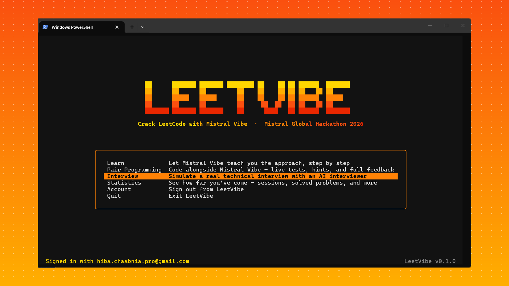
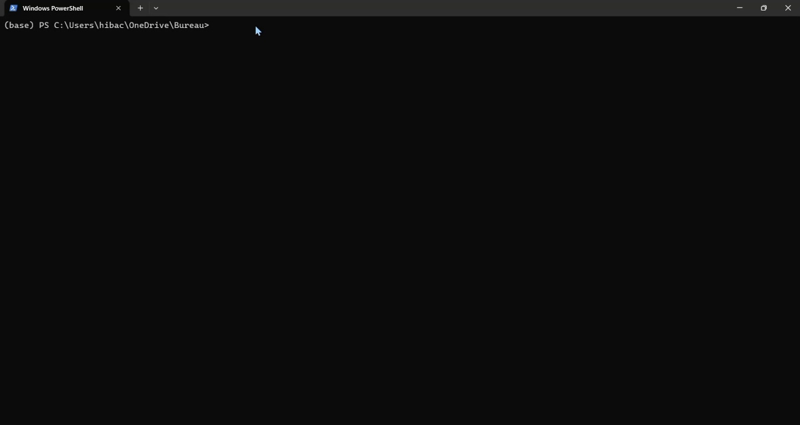
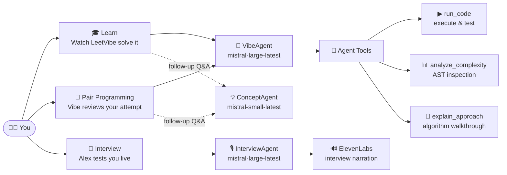
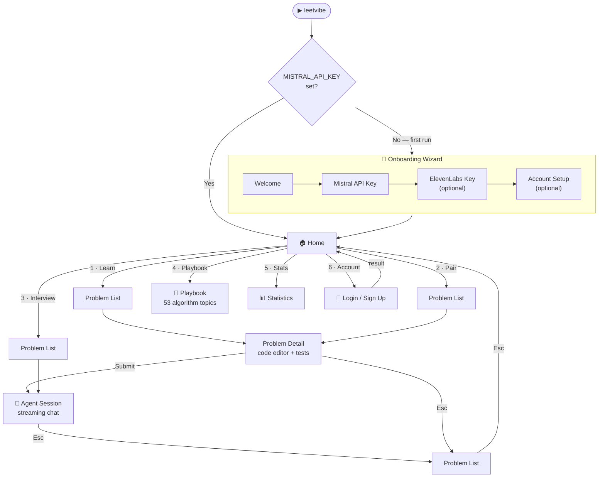
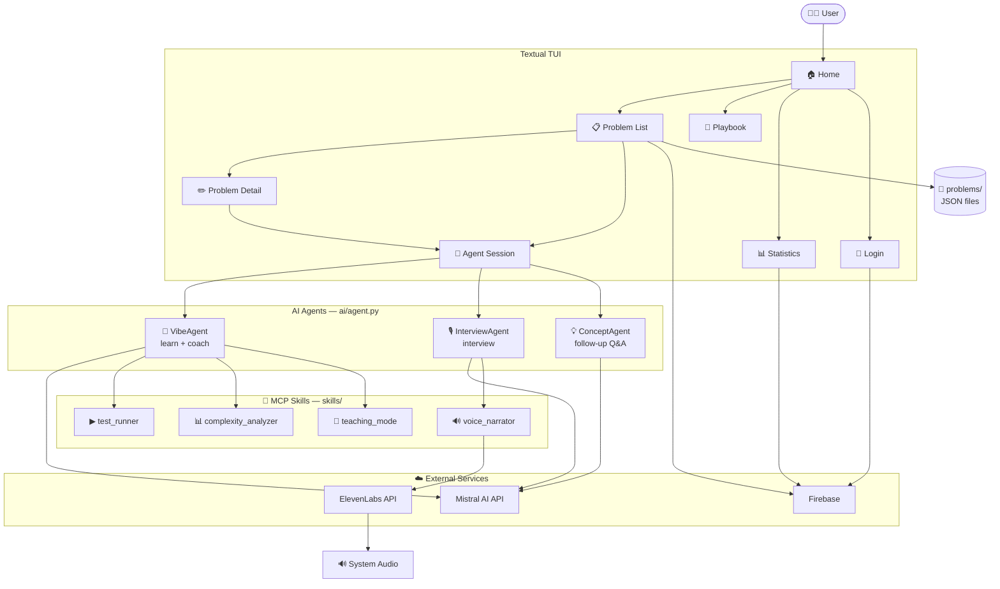
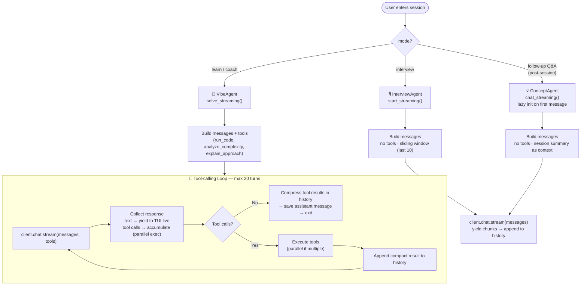
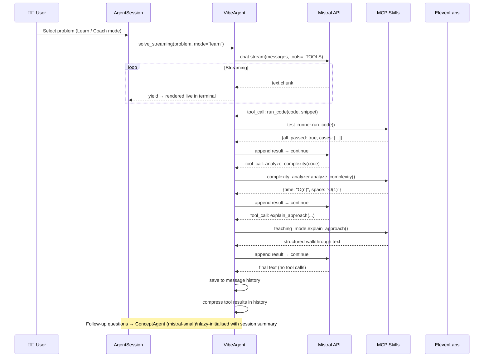
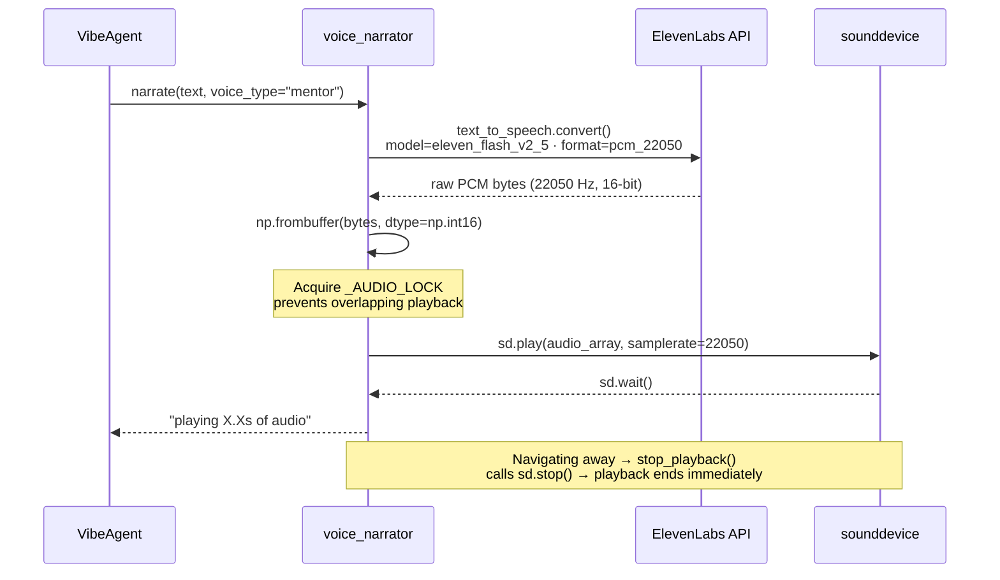
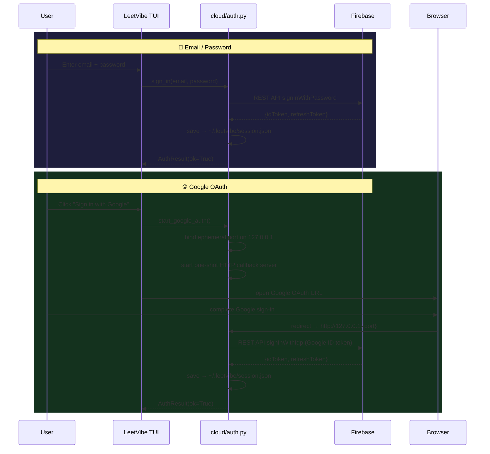

# 🎯 LeetVibe

> **Your AI pair programmer for LeetCode — powered by Mistral AI**

Stop grinding alone. LeetVibe puts a senior engineer in your terminal who can teach, coach, or interview you — depending on how much help you want today.

---

## 🎬 Demo

### Full App Demo

[](https://www.youtube.com/watch?v=eEAsmaeVm14)

> Click the thumbnail to watch the full demo on YouTube.

### ⚙️ Onboarding Setup



---

## 🧠 How It Works

LeetVibe is an autonomous AI agent that doesn't just answer questions, it reasons, runs code, measures complexity, and explains its thinking step by step. Every session is a live conversation: you can ask follow-up questions, push back, or go deeper at any point.

**Three modes. Three different relationships with the AI.**


```mermaid
graph LR
    You(["🧑‍💻 You"]) --> Learn["🎓 Learn\nWatch LeetVibe solve it"]
    You --> Pair["🤝 Pair Programming\nVibe reviews your attempt"]
    You --> Interview["🎤 Interview\nAlex tests you live"]

    Learn & Pair --> VibeAgent["🤖 VibeAgent\nmistral-large-latest"]
    Interview --> InterviewAgent["🎙️ InterviewAgent\nmistral-large-latest"]
    Learn & Pair -.->|"follow-up Q&A"| ConceptAgent["💡 ConceptAgent\nmistral-small-latest"]

    VibeAgent --> Tools["🔧 Agent Tools"]
    Tools --> RunCode["▶ run_code\nexecute & test"]
    Tools --> Complexity["📊 analyze_complexity\nAST inspection"]
    Tools --> Explain["📖 explain_approach\nalgorithm walkthrough"]

    InterviewAgent --> Voice["🔊 ElevenLabs\ninterview narration"]
```

---

## 🎓 Learn Mode

*"Teach me how to solve this."*

LeetVibe takes the wheel. It walks through the problem using a strict **8-step workflow** — reasoning out loud, running real code, and narrating every decision. You watch, listen, and absorb.

| Step | What Vibe Does |
|------|---------------|
| 1️⃣ Understand | Restates the problem, identifies edge cases and algorithm family |
| 2️⃣ Brute Force | Writes the simplest correct solution and runs it against test cases |
| 3️⃣ Analyse | Calls `analyze_complexity` — "This is O(n²) because of the nested loops" |
| 4️⃣ Key Insight | Names the one idea that eliminates the bottleneck |
| 5️⃣ Optimal | Writes the optimised solution and validates it with `run_code` |
| 6️⃣ Compare | Calls `analyze_complexity` again — "We improved from O(n²) → O(n)" |
| 7️⃣ Walkthrough | Calls `explain_approach` for a structured pattern breakdown |
| 8️⃣ Synthesis | Writes a crisp 4–6 sentence takeaway paragraph — the core insight, the journey, the final complexity |

> Vibe never skips a step, even for trivial problems. If a test fails, it debugs and fixes before moving on.

> After the session a one-line **algorithm mnemonic** is generated and appended inline — a 25-word analogy that captures the pattern's mechanical action, cached per pattern in `~/.leetvibe/mnemonics.json`.

---

## 🤝 Pair Programming Mode

*"Review my attempt and guide me to the optimal."*

You write first. Vibe reviews. It follows a **6-step coaching workflow** designed to push you toward the answer — not hand it to you.

| Step | What Vibe Does |
|------|---------------|
| 1️⃣ Test | Runs your code: "Your solution passes 3/5 test cases" |
| 2️⃣ Diagnose | Points to exact lines — bugs, inefficiencies, edge case gaps |
| 3️⃣ Analyse | Measures your complexity: "Your solution is O(n²) because..." |
| 4️⃣ Hint | Nudges without revealing: "What data structure gives O(1) lookup?" |
| 5️⃣ Optimal | Only now reveals the full solution with line-by-line explanation |
| 6️⃣ Compare | Side-by-side: your approach vs optimal, complexity improvement named |
| 7️⃣ Walkthrough | Calls `explain_approach` for a structured pattern breakdown |
| 8️⃣ Synthesis | Crisp paragraph: core insight, what changed, final complexity |

---

## 🎤 Interview Mode

*"Test me like it's a real interview."*

Meet **Alex** — a senior software engineer who conducts 30-minute mock technical interviews. No hints unless you're stuck. No code written for you. Just a realistic conversation.

**Alex's rules:**
- 🤝 Greets you once, states the problem, asks for your approach
- 🔍 Probes with *"What's the time complexity?"* / *"Any edge cases?"* / *"Can you do better?"*
- 💡 Gives **one small hint** if you're stuck, then waits
- ✅ Closes with brief feedback on correctness, complexity, and one thing to improve
- 🔇 Never re-introduces himself on follow-up turns
- 🚫 Never writes code, never reveals the optimal solution unprompted

His opening monologue plays as speech via ElevenLabs so the session feels live from the first second.

---

## 🆚 Mode Comparison

| | 🎓 Learn | 🤝 Pair Programming | 🎤 Interview |
|---|---|---|---|
| Who codes first | Vibe | You | — (verbal only) |
| Tools enabled | ✅ run_code, complexity, explain | ✅ run_code, complexity, explain | ❌ none |
| Voice narration | ❌ | ❌ | ✅ each AI turn (ElevenLabs) |
| Follow-up chat | ✅ ConceptAgent (mistral-small) | ✅ ConceptAgent (mistral-small) | ✅ InterviewAgent continues |
| Gives hints | — | ✅ Socratic nudges | ✅ one hint only |
| Reveals optimal | ✅ always | ✅ after coaching | ❌ never |
| Response length | Long — full explanations | Long — detailed review | Short — 2–4 sentences |

---

## 📖 Playbook

*"I want to study algorithm patterns before I practice."*

The Playbook is an in-terminal algorithm reference guide covering **53 patterns** — from foundational Arrays and Binary Search to advanced topics like Network Flow, Segment Tree, and Digit DP. Every topic includes a diagram, code templates, complexity analysis, pitfalls, and classic problems to practice.

| Section | What's Inside |
|---------|--------------|
| Recognise by | Keywords and constraints that signal this pattern |
| Diagram | ASCII art showing the data-structure or pointer movement |
| When to use | One-line decision rule |
| Pattern | Primary code template in Python |
| Pattern — Variant | Second template for related sub-patterns |
| Complexity | Time and space with explanation |
| Pitfalls | Common mistakes and edge-case traps |
| Classic Problems | Curated LeetCode problems with difficulty |
| My Notes | Personal notes you write and persist locally |

**53 topics across 11 categories and 3 tiers:**

| Tier | Topics |
|------|--------|
| ① Foundational | Arrays, Two Pointers, Sliding Window, Stack, Binary Search, Linked List, Trees, Graphs, BFS/DFS, Dynamic Programming, Heap, Strings, Simulation, Backtracking |
| ② Intermediate | Monotonic Stack/Queue, Fast & Slow Pointers, Modified Binary Search, Tries, Union Find, Topological Sort, Dijkstra, Greedy, Intervals, Merge Sort, Cyclic Sort, Sweep Line, Difference Array, LRU Cache, Sorted List, Iterator |
| ③ Advanced | Bellman-Ford, Floyd-Warshall, Segment Tree, SCC, Eulerian Path, Network Flow, Digit DP, Probability DP, Game Theory, Rabin-Karp, Z-Algorithm, Manacher's, Concurrency, Reservoir Sampling |

**Playbook keyboard shortcuts:**

| Key | Action |
|-----|--------|
| `↑` / `↓` | Navigate topics |
| `C` | Cycle category filter (Arrays → Stack & Queue → … → All) |
| `T` | Cycle tier filter (All → ① → ② → ③ → All) |
| `E` | Ask Vibe AI about the current pattern (inline chat) |
| `P` | Jump to practice problems for this topic |
| `N` | Add or edit personal notes |
| `X` | Export all topics + notes to DOCX |
| `Esc` | Go back |

A **▶ Pattern Selector** entry at the top maps problem keywords to patterns — use it when you can't immediately identify which pattern applies.

---

## ✨ More Features

- 📚 **Problem browser** — filter by difficulty, topic, or solved status; free-text search across hundreds of LeetCode problems
- ✏️ **Inline code editor** — write Python in the terminal with syntax highlighting and run it against the problem's test cases without leaving the app
- 📋 **Live test results** — pass/fail output per test case shown immediately
- 💡 **Solution tab** — reference solutions when they exist in the problem data
- 📊 **Statistics screen** — session counts, solved problem tracking, progress over time
- ☁️ **Cloud sync** — optional account (email/password or Google OAuth) to persist progress across machines
- 🧙 **Onboarding wizard** — first-run setup collects API keys and account details interactively; nothing to configure by hand

---

## 🚀 Getting Started

### Install from PyPI

Requires **Python 3.11+**.

```bash
# with uv (recommended)
uv tool install leetvibe

# with pip
pip install leetvibe
```

```bash
leetvibe
```

The onboarding wizard opens automatically on first launch. It will ask for your **Mistral API key** (required) and optionally your **ElevenLabs key** for voice narration. Keys are saved to `~/.leetvibe/.env` and never touched again.

- 🔑 Get a Mistral key: https://console.mistral.ai
- 🔊 Get an ElevenLabs key: https://elevenlabs.io *(optional)*

---

### Install from Source

**Requirements:** Python 3.11+, [uv](https://docs.astral.sh/uv/)

```bash
git clone https://github.com/hibachaabnia/leetvibe.git
cd leetvibe
uv sync
uv run leetvibe
```

For local development, copy `.env.exemple` to `.env` and fill in your keys:

```
MISTRAL_API_KEY=your_key_here
ELEVENLABS_API_KEY=your_key_here   # optional
```

---

## 🗺️ Navigation


```mermaid
flowchart TD
    Launch(["▶ leetvibe"])
    Launch --> Check{"MISTRAL_API_KEY\nset?"}
    Check -- "No — first run" --> Onboard
    Check -- "Yes" --> Home

    subgraph Onboard["🧙 Onboarding Wizard"]
        W["Welcome"] --> AK["Mistral API Key"]
        AK --> EL["ElevenLabs Key\n(optional)"]
        EL --> AC["Account Setup\n(optional)"]
    end

    Onboard --> Home["🏠 Home"]

    Home -- "1 · Learn" --> LL["Problem List"]
    Home -- "2 · Pair" --> CL["Problem List"]
    Home -- "3 · Interview" --> IL["Problem List"]
    Home -- "4 · Playbook" --> Playbook["📖 Playbook\n53 algorithm topics"]
    Home -- "5 · Stats" --> Stats["📊 Statistics"]
    Home -- "6 · Account" --> Login["🔐 Login / Sign Up"]
    Login -- result --> Home

    LL & CL --> Detail["Problem Detail\ncode editor + tests"]
    Detail -- "Submit" --> Session["💬 Agent Session\nstreaming chat"]
    IL --> Session

    Session -- "Esc" --> CL2["Problem List"]
    Detail -- "Esc" --> CL2
    CL2 -- "Esc" --> Home
```

**Keyboard shortcuts:**

| Key | Action |
|-----|--------|
| `1`–`6` | Home screen quick-select |
| `Enter` | Open / confirm |
| `Esc` | Go back |
| `Ctrl+D` | Toggle description panel (+ Alex's opening in Interview) |
| `Ctrl+V` | Toggle voice narration |
| `Ctrl+C` | Copy last code block |
| `Ctrl+Q` | Quit from anywhere |

---

## 🏗️ Architecture


```mermaid
graph TD
    User(["🧑‍💻 User"])

    subgraph TUI["Textual TUI"]
        Home["🏠 Home"]
        ProblemList["📋 Problem List"]
        Detail["✏️ Problem Detail"]
        AgentSession["💬 Agent Session"]
        Playbook["📖 Playbook"]
        Stats["📊 Statistics"]
        Login["🔐 Login"]
    end

    subgraph Agents["AI Agents — ai/agent.py"]
        VibeAgent["🤖 VibeAgent\nlearn + coach"]
        InterviewAgent["🎙️ InterviewAgent\ninterview"]
        ConceptAgent["💡 ConceptAgent\nfollow-up Q&A"]
    end

    subgraph Skills["🔧 MCP Skills — skills/"]
        TestRunner["▶ test_runner"]
        Complexity["📊 complexity_analyzer"]
        Teaching["📖 teaching_mode"]
        Voice["🔊 voice_narrator"]
    end

    subgraph External["☁️ External Services"]
        MistralAPI["Mistral AI API"]
        ElevenLabsAPI["ElevenLabs API"]
        FirestoreDB["Firebase"]
    end

    Problems[("📁 problems/\nJSON files")]
    Audio["🔊 System Audio"]

    User --> Home
    Home --> ProblemList & Playbook & Stats & Login
    ProblemList --> Detail & AgentSession
    Detail --> AgentSession

    AgentSession --> VibeAgent & InterviewAgent & ConceptAgent
    VibeAgent --> MistralAPI
    InterviewAgent & ConceptAgent --> MistralAPI
    VibeAgent --> TestRunner & Complexity & Teaching
    InterviewAgent --> Voice

    Voice --> ElevenLabsAPI --> Audio
    Login & Stats & ProblemList --> FirestoreDB
    ProblemList --> Problems
```

**Project layout:**

```
leetvibe/
├── cli.py                    Entry point
├── config.py                 Loads config.yaml + .env → Config dataclass
├── session_log.py            Local session recorder (JSONL)
├── problem_loader.py         Reads problem JSONs from problems/
├── code_runner.py            Sandboxed Python test execution
├── ai/
│   ├── agent.py              VibeAgent · InterviewAgent · ConceptAgent
│   └── skills/
│       ├── test_runner/      Execute code against test cases
│       ├── complexity_analyzer/  AST-based O(n) analysis (result-cached)
│       ├── teaching_mode/    Algorithm pattern explanations
│       └── voice_narrator/   ElevenLabs TTS (interview mode only)
├── cloud/
│   ├── auth.py               Firebase auth (email + Google OAuth)
│   └── db.py                 Cloud sync — solved slugs, sessions, messages
├── data/
│   └── topics/               53 algorithm topic modules + metadata
└── ui/
    ├── screens/              home, problem_list, problem_detail,
    │                         agent_session, reference_guide, stats, login
    └── widgets/              banner, problem_table, status_bar

problems/
├── easy/ · medium/ · hard/   Problem JSON files
```

---

## ⚙️ How Mistral Vibe Powers LeetVibe

Three focused agents, each built directly on Mistral's streaming API. No LangChain, no wrappers — just raw streaming with full control over what renders in the terminal.

| Agent | Model | Purpose | Tools |
|---|---|---|---|
| `VibeAgent` | `mistral-large-latest` | Learn + Coach — 8-step structured session | `run_code`, `analyze_complexity`, `explain_approach` |
| `InterviewAgent` | `mistral-large-latest` | Mock interview — conversational, sliding-window context (last 10 messages) | none |
| `ConceptAgent` | `mistral-small-latest` | Follow-up Q&A after session — lazily initialised on first question | none |

### The Agent Loop


```mermaid
flowchart TD
    Start(["User enters session"])

    Start --> Mode{mode?}
    Mode -- "learn / coach" --> VA["🤖 VibeAgent\nsolve_streaming()"]
    Mode -- "interview" --> IA["🎙️ InterviewAgent\nstart_streaming()"]
    Mode -- "follow-up Q&A\n(post-session)" --> CA["💡 ConceptAgent\nchat_streaming()\nlazy init on first message"]

    VA --> BuildMsg["Build messages + tools\n(run_code, analyze_complexity, explain_approach)"]
    IA --> BuildMsgNoTools["Build messages\nno tools · sliding window (last 10)"]
    CA --> BuildMsgSmall["Build messages\nno tools · session summary as context"]

    BuildMsg --> Loop

    subgraph Loop["🔁 Tool-calling Loop — max 20 turns"]
        Stream["client.chat.stream(messages, tools)"]
        Collect["Collect response\ntext → yield to TUI live\ntool calls → accumulate (parallel exec)"]
        Stream --> Collect
        Collect --> HasTools{"Tool calls?"}

        HasTools -- "No" --> Compress["Compress tool results in history\n→ save assistant message → exit"]
        HasTools -- "Yes" --> Exec["Execute tools\n(parallel if multiple)"]
        Exec --> AppendResult["Append compact result to history"]
        AppendResult --> Stream
    end

    BuildMsgNoTools & BuildMsgSmall --> SimpleStream["client.chat.stream(messages)\nyield chunks → append to history"]
```

### System Prompts

Each mode gets a completely different personality baked into the system prompt:

- 📜 **`SYSTEM_PROMPT`** (`VibeAgent` learn) — 8-step workflow, think out loud before every code block, never skip a step. Rich markup (`[bold]`, `[dim]`) rendered by Textual.
- 📜 **`COACH_PROMPT`** (`VibeAgent` coach) — test user's code first, diagnose exact lines, give Socratic hints before revealing the optimal, frame feedback as encouragement.
- 📜 **`INTERVIEW_PROMPT`** (`InterviewAgent`) — 2–4 sentences per turn, never re-introduce, never write code, one hint max. No tools. Sliding window keeps context lean.
- 📜 **`_CONCEPT_SYSTEM`** (`ConceptAgent`) — algorithm educator persona, answer concisely with examples, connect back to the problem just solved. Session context (pattern, synthesis, complexity) injected at init.

### Agent Tools

| 🔧 Tool | Agent | Skill | What It Does |
|---------|-------|-------|-------------|
| `run_code` | `VibeAgent` | `test_runner` | Executes Python code against test cases in a sandboxed namespace. Returns pass/fail per case. Results compressed in history after use. |
| `analyze_complexity` | `VibeAgent` | `complexity_analyzer` | Walks the AST — counts loop nesting depth, detects sorting calls, memoization. Returns `{time, space, explanation}`. Results cached per code hash. |
| `explain_approach` | `VibeAgent` | `teaching_mode` | Generates a structured 6-step walkthrough for 15+ algorithm patterns (two-pointer, DP, sliding window, BFS, heap, trie…). |

### Full Session Flow


```mermaid
sequenceDiagram
    participant U as 🧑‍💻 User
    participant UI as AgentSession
    participant A as VibeAgent
    participant M as Mistral API
    participant S as MCP Skills
    participant EL as ElevenLabs

    U->>UI: Select problem (Learn / Coach mode)
    UI->>A: solve_streaming(problem, mode="learn")
    A->>M: chat.stream(messages, tools=_TOOLS)

    loop Streaming
        M-->>A: text chunk
        A-->>UI: yield → rendered live in terminal
    end

    M-->>A: tool_call: run_code(code, snippet)
    A->>S: test_runner.run_code()
    S-->>A: {all_passed: true, cases: [...]}
    A->>M: append result → continue

    M-->>A: tool_call: analyze_complexity(code)
    A->>S: complexity_analyzer.analyze_complexity()
    S-->>A: {time: "O(n)", space: "O(1)"}
    A->>M: append result → continue

    M-->>A: tool_call: explain_approach(...)
    A->>S: teaching_mode.explain_approach()
    S-->>A: structured walkthrough text
    A->>M: append result → continue

    M-->>A: final text (no tool calls)
    A->>A: save to message history
    A->>A: compress tool results in history
    Note over UI,A: Follow-up questions → ConceptAgent (mistral-small)\nlazy-initialised with session summary
```

---

## 🔊 How ElevenLabs Powers the Voice

Voice narration is used exclusively in **Interview mode** — `InterviewAgent` narrates each of Alex's responses via ElevenLabs. The `voice_narrator` skill converts text to raw PCM audio and plays it directly through `sounddevice` — no ffmpeg required.

### Voice Personas

| Persona | Voice | Used In |
|---------|-------|---------|
| `mentor` | Sarah | Interview — Alex's turn narration |

### Audio Pipeline


```mermaid
sequenceDiagram
    participant A as VibeAgent
    participant VN as voice_narrator
    participant EL as ElevenLabs API
    participant SD as sounddevice

    A->>VN: narrate(text, voice_type="mentor")
    VN->>EL: text_to_speech.convert()<br/>model=eleven_flash_v2_5 · format=pcm_22050
    EL-->>VN: raw PCM bytes (22050 Hz, 16-bit)
    VN->>VN: np.frombuffer(bytes, dtype=np.int16)
    Note over VN: Acquire _AUDIO_LOCK<br/>prevents overlapping playback
    VN->>SD: sd.play(audio_array, samplerate=22050)
    SD-->>VN: sd.wait()
    VN-->>A: "playing X.Xs of audio"
    Note over VN,SD: Navigating away → stop_playback()<br/>calls sd.stop() → playback ends immediately
```

**Two playback modes:**
- 🔄 `narrate()` — fires a background thread, returns immediately. Used during agent tool loops so the AI keeps going while audio plays.
- ⏸️ `narrate_blocking()` — blocks until audio finishes. Used for Alex's interview opening so the session feels live before you type.

---

## 🔐 Auth Flow

Optional cloud account to sync your progress. Two sign-in methods via Firebase:


```mermaid
sequenceDiagram
    participant User
    participant App as LeetVibe TUI
    participant Auth as cloud/auth.py
    participant Firebase
    participant Browser

    rect rgb(30, 30, 60)
        Note over User,Firebase: 📧 Email / Password
        User->>App: Enter email + password
        App->>Auth: sign_in(email, password)
        Auth->>Firebase: REST API signInWithPassword
        Firebase-->>Auth: {idToken, refreshToken}
        Auth->>Auth: save → ~/.leetvibe/session.json
        Auth-->>App: AuthResult(ok=True)
    end

    rect rgb(20, 50, 30)
        Note over User,Firebase: 🌐 Google OAuth
        User->>App: Click "Sign in with Google"
        App->>Auth: start_google_auth()
        Auth->>Auth: bind ephemeral port on 127.0.0.1
        Auth->>Auth: start one-shot HTTP callback server
        App->>Browser: open Google OAuth URL
        User->>Browser: complete Google sign-in
        Browser->>Auth: redirect → http://127.0.0.1:{port}
        Auth->>Firebase: REST API signInWithIdp (Google ID token)
        Firebase-->>Auth: {idToken, refreshToken}
        Auth->>Auth: save → ~/.leetvibe/session.json
        Auth-->>App: AuthResult(ok=True)
    end
```

---

## 🔧 Configuration

`config.yaml` (committed — no secrets):
```yaml
mistral:
  model: "mistral-large-latest"
  qa_model: "mistral-small-latest"   # used by ConceptAgent for follow-up Q&A

elevenlabs:
  voice_id: "EXAVITQu4vr4xnSDxMaL"
  enabled: true
```

`~/.leetvibe/.env` (created by the wizard — never committed):
```
MISTRAL_API_KEY=your_key
ELEVENLABS_API_KEY=your_key    # optional
```

The config loader checks `~/.leetvibe/.env` → project `.env` → environment variables, in that order.

---

## 📦 Dependencies

| Package | Purpose |
|---------|---------|
| `mistralai` | Mistral AI SDK — streaming chat + tool calling |
| `elevenlabs` | Text-to-speech |
| `textual` | Terminal UI framework |
| `sounddevice` + `numpy` | PCM audio playback |
| `firebase` (REST API) | Auth + cloud sync |
| `mcp` | MCP skill server infrastructure |
| `python-dotenv` · `pyyaml` | Config loading |
| `click` | CLI entry point |
| `rich` | Terminal formatting |

---

## 📄 License

MIT © 2026 Hiba Chaabnia
