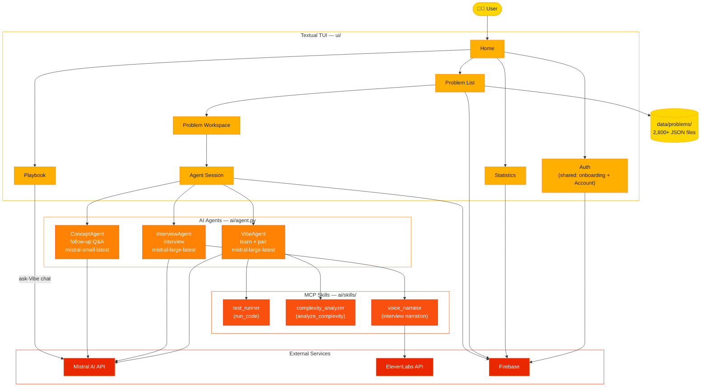
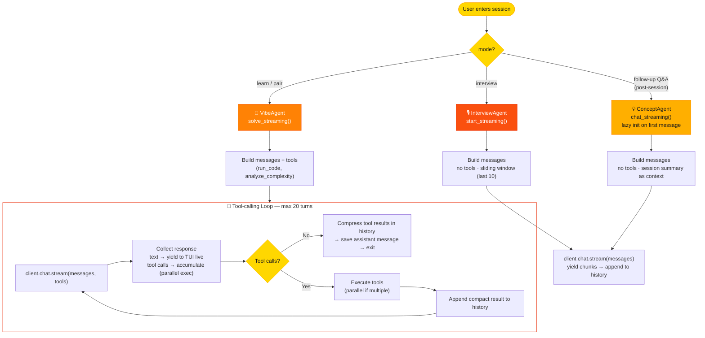
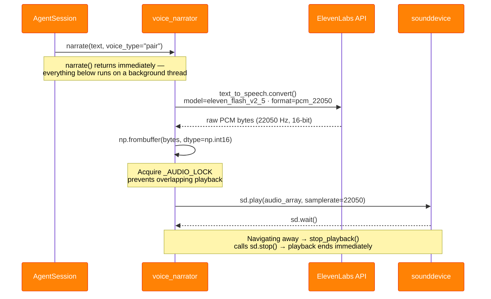
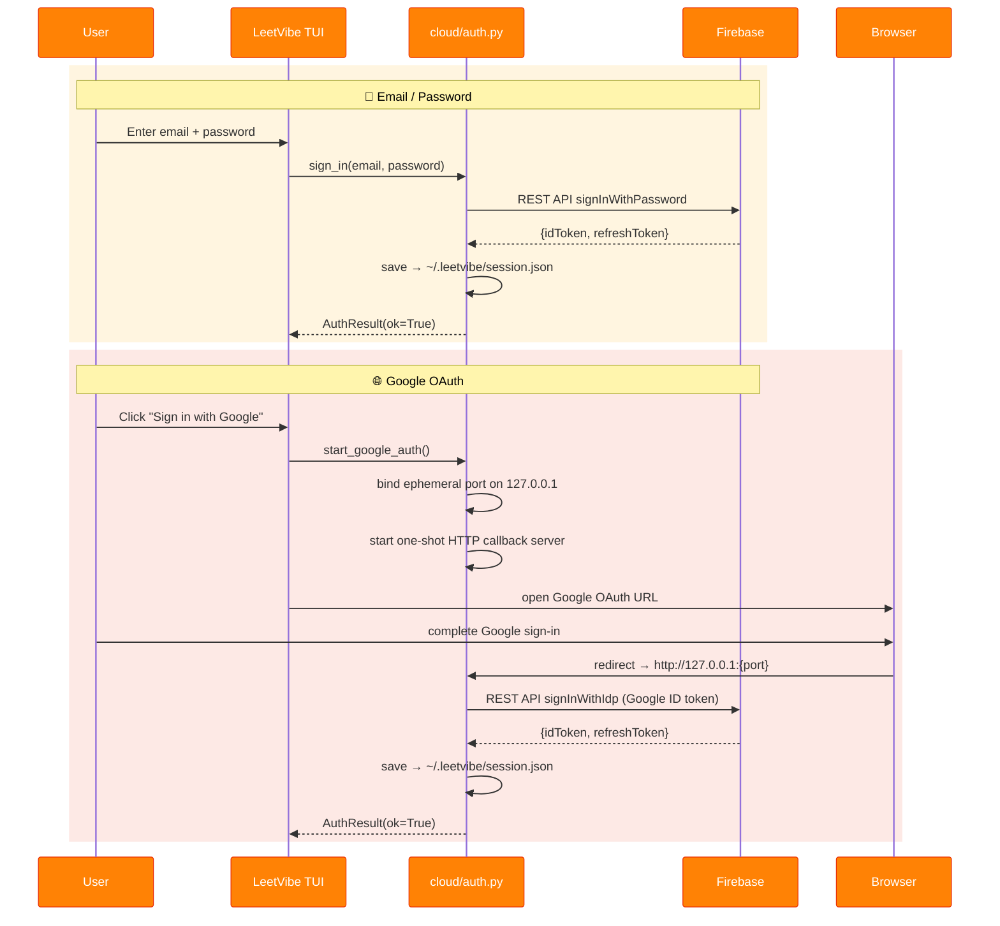

# 🏗️ Architecture Deep Dive

Internal development notes for LeetVibe — the system overview, codebase layout, agent loop, system prompts, playbook internals, voice pipeline, local state, and cloud sync & auth. For the user-facing overview (modes, install, features), see the [README](../README.md).

## 🗺️ System Overview



### Project Layout

```
leetvibe/
├── cli.py                    Entry point — runs onboarding if needs_setup()
├── config.py                 Loads config.yaml + .env → Config dataclass
├── problem_loader.py         Reads problem JSONs
├── code_runner.py            Sandboxed Python test execution
├── docx_exporter.py          Playbook topics + notes → DOCX
├── update_check.py           Daily PyPI version check
├── ai/
│   ├── agent.py              VibeAgent · InterviewAgent · ConceptAgent
│   └── skills/               test_runner · complexity_analyzer ·
│                             voice_narrator (MCP servers)
├── cloud/
│   ├── auth.py               Firebase auth (email + Google OAuth)
│   └── db.py                 Firestore sync — sessions, messages, solutions, feedback
├── data/
│   ├── problems/             2,800+ problem JSONs — easy/ · medium/ · hard/
│   └── topics/               52 algorithm topic modules + metadata
└── ui/
    ├── theme.py              Fire-gradient palette constants
    ├── apps/
    │   ├── main.py            LeetVibeApp — screen registry, global bindings
    │   ├── onboarding.py      OnboardingApp + run_onboarding — first-run wizard flow
    │   └── styles/            main.tcss · onboarding.tcss
    ├── markup.py              Shared Markdown → Rich renderer — used by both
    │                          agent chat bubbles and Playbook content panes
    ├── keys.py                Terminal key-handling quirks shared across
    │                          text-input widgets (e.g. swallowed-space workaround)
    ├── screens/
    │   ├── base.py            Shared screen behaviour
    │   ├── confirm.py         ConfirmModal — generic yes/no confirmation dialog
    │   ├── home.py · stats.py · feedback.py
    │   ├── problem/           list.py · workspace.py (ProblemWorkspaceScreen —
    │   │                      two-panel LeetCode-style layout with custom top bar)
    │   ├── agent/             session.py (streaming chat, tool-result transcript
    │   │                      rendering, post-session mnemonics)
    │   ├── playbook/          screen.py (PlaybookScreen) · render.py
    │   │                      (topic → Rich markup, notes/history persistence) ·
    │   │                      panels.py (chat panel, notes editor)
    │   ├── auth/              Shared auth flow — auth_choice · login · signup ·
    │   │                      google_auth (used by onboarding *and* Home's Account option)
    │   └── onboarding/        Wizard steps — welcome, API keys (Mistral, ElevenLabs)
    └── widgets/               banner · problem_card · problem_table ·
                               status_bar · truncated_select · shimmer_title ·
                               chat_bubbles (ChatBubbleLog, StepAnswerBubble,
                               ThinkingIndicator — shared by agent session and Playbook chat)
```

## 🤖 The AI Agents

Three focused agents live in `leetvibe/ai/agent.py`, each built directly on Mistral's streaming API: `VibeAgent` (learn + pair programming; `mistral-large-latest`, with tools), `InterviewAgent` (conversational, no tools; `mistral-large-latest`), and `ConceptAgent` (post-session Q&A; `mistral-small-latest`).

### The Agent Loop



### System Prompts

Each mode gets a completely different personality baked into the system prompt:

- **`SYSTEM_PROMPT`** (`VibeAgent` learn) — 7-step workflow (Understand → First Pass → Spot the Bottleneck → The Insight → Optimize → Measure the Gain → Takeaway), think out loud before every code block, never skip a step. Markdown-only formatting (no Rich markup tags — `ui/markup.py` normalises whatever slips through anyway).
- **`PAIR_PROMPT`** (`VibeAgent` pair, renamed from `COACH_PROMPT`) — runs the user's code first, diagnoses exact lines, bridges the gap with a narrated hint-to-reveal chain before showing the optimal, frames feedback as encouragement.
- **`INTERVIEW_PROMPT`** (`InterviewAgent`) — 2–4 sentences per turn, never re-introduce, never write code, one hint max. No tools. Sliding window keeps context lean.
- **`_CONCEPT_SYSTEM`** (`ConceptAgent`) — algorithm educator persona, answer concisely with examples, connect back to the problem just solved. Session context (pattern, synthesis, complexity) injected at init.

Both `SYSTEM_PROMPT` and `PAIR_PROMPT` end their final step with a short paragraph, one open question for the user to answer in follow-up chat, and a hidden `Pattern: <slug>` line (parsed by `session.py`, never shown). `SYSTEM_PROMPT_VERSION`/`PAIR_PROMPT_VERSION` are sha256 fingerprints of the prompt text, stamped on each Firestore session doc as `workflow_version` — see [Cloud Sync & Auth](#-cloud-sync--auth) for how that invalidates stale resumed sessions after a prompt edit.

### Agent Tools

| Tool | Agent | Skill | What It Does |
|---------|-------|-------|-------------|
| `run_code` | `VibeAgent` | `test_runner` | Executes Python code against test cases via `run_tests_with_timeout()` — an isolated subprocess killed after a 10s wall-clock cap, so an infinite loop in AI- or user-written code can't hang the session. Returns pass/fail, expected vs. actual output per case. Results compressed in history after use. |
| `analyze_complexity` | `VibeAgent` | `complexity_analyzer` | Walks the AST — counts loop nesting depth, detects sorting calls, memoization. Returns `{time, space, explanation}`. Results cached per code hash (bounded FIFO, 200 entries). |

The fourth skill, `voice_narrator`, is not an LLM tool — the Agent Session screen invokes it directly to narrate Alex's replies in Interview mode (see [Voice Pipeline](#-voice-pipeline-elevenlabs)). Tool results render as an icon-header + box-drawn detail table in the transcript (`agent.py`'s `format_tool_block()`), shared by both the live streaming loop and history replay.

### Full Session Flow

```mermaid
%%{init: {'themeVariables': {'actorBkg': '#FF8205', 'actorTextColor': '#ffffff', 'actorBorder': '#E92700'}}}%%
sequenceDiagram
    participant U as 🧑‍💻 User
    participant UI as AgentSession
    participant A as VibeAgent
    participant M as Mistral API
    participant S as MCP Skills

    U->>UI: Select problem (Learn / Pair mode)
    UI->>A: solve_streaming(problem, mode="learn")
    A->>M: chat.stream(messages, tools=_TOOLS)

    loop Streaming
        M-->>A: text chunk
        A-->>UI: yield → rendered live in terminal
    end

    M-->>A: tool_call: run_code(code, snippet)
    A->>S: test_runner.run_code()
    S-->>A: {all_passed: true, cases: [...]}
    A->>M: append result → continue

    M-->>A: tool_call: analyze_complexity(code)
    A->>S: complexity_analyzer.analyze_complexity()
    S-->>A: {time: "O(n)", space: "O(1)"}
    A->>M: append result → continue

    M-->>A: final text (no tool calls)<br/>ends with "Pattern: &lt;slug&gt;" line
    A->>A: save to message history
    A->>A: compress tool results in history
    Note over UI,A: Follow-up questions → ConceptAgent (mistral-small)<br/>lazy-initialised with session summary
```

When a Learn/Pair session completes, the screen also generates a one-line **pattern mnemonic** — a `mistral-small-latest` call capped at 25 words that describes the algorithm's mechanical action — and appends it inline. Mnemonics are cached per pattern in `~/.leetvibe/mnemonics.json`, so each pattern costs one API call ever.

## 📖 Playbook Internals

The Playbook screen (`ui/screens/playbook/screen.py`, class `PlaybookScreen`) renders the 52 topic modules in `data/topics/` — each module exports a `TOPIC` dict (the schema is documented in [CONTRIBUTING.md](../CONTRIBUTING.md)), and `_metadata.py` assigns every topic its category and tier for the filter bar. Rendering and persistence (topic → Rich markup, notes/history read-write) live in `playbook/render.py`; the interactive side panels (chat, notes editor, thinking indicator) live in `playbook/panels.py`. Three interactive layers sit on top of the static content:

- **Ask-Vibe chat (`E`)** — `PlaybookChatPanel` streams directly from the Mistral API (`config.mistral_qa_model`); no agent class is involved. The system prompt embeds the current topic's full reference text as context, each request sends the last 10 prior turns, and the complete history for every topic is persisted to `~/.leetvibe/chat_histories.json` — so conversations survive restarts.
- **Notes (`N`)** — per-topic notes saved to `~/.leetvibe/notes.json` from the inline notes panel.
- **DOCX export (`X`)** — `docx_exporter.export_reference_docx()` renders all topics plus the user's notes into a single document.

## 🔊 Voice Pipeline (ElevenLabs)

Voice narration is used exclusively in **Interview mode**. The `voice_narrator` skill converts text to raw PCM audio and plays it directly through `sounddevice` — no ffmpeg required.

### Audio Pipeline



## 💾 Local State

Everything LeetVibe writes to the user's machine lives in `~/.leetvibe/`:

| File | Written by | Contents |
|------|-----------|----------|
| `.env` | onboarding wizard | API keys |
| `session.json` | `cloud/auth.py` | Firebase ID + refresh tokens |
| `notes.json` | Playbook notes panel | per-topic notes |
| `chat_histories.json` | Playbook chat panel | per-topic ask-Vibe history |
| `mnemonics.json` | agent session | cached pattern mnemonics |
| `update_check.json` | `update_check.py` | 24h PyPI version-check cache |
| `pending_sync.json` | `cloud/db.py` | failed `save_messages()` calls, retried by `flush_pending_saves()` at app startup |

## ☁️ Cloud Sync & Auth

An optional account syncs progress across machines. Everything works logged-out: every public function in `cloud/db.py` returns empty/`False`/`None` instead of raising when there is no session, and network errors are swallowed so sync can never crash the TUI.

Firestore is reached through its plain REST API with `requests` — no Firebase SDK, no service account. Users authenticate with their own ID token and Firestore Security Rules enforce per-user data isolation. A 401 response triggers a one-shot token refresh and retry.

### What Syncs

| Firestore collection | Written when | Contents |
|---|---|---|
| `chat_sessions` | a session starts (`upsert_session`) | problem + mode metadata, `reset_count` |
| `chat_messages` | after each completed agent turn (`save_messages`) | full message list, system prompts excluded — delete-then-reinsert |
| `user_solutions` | a solution passes (`mark_solved`) | solved slug + submitted code, overwritten on re-submit |
| `feedback` | feedback screen (`submit_feedback`) | bug reports / feature requests |

Document IDs are deterministic — `{user_id}__{slug}__{mode}` for sessions, `{user_id}__{slug}` for solutions — so upserts need no queries and no extra indexes. On returning to a problem, `load_messages` rebuilds the agent's message list from `chat_messages` (system prompts are always rebuilt locally), which is what makes sessions resume across machines. The Stats screen computes session counts and solve streaks from these collections at read time — nothing is precomputed server-side.

`upsert_session()` stamps each Learn/Pair session doc with `workflow_version` (the sha256 fingerprint of the active `SYSTEM_PROMPT`/`PAIR_PROMPT`, see [The AI Agents](#-the-ai-agents)) and returns `(doc_id, stale)`. `stale` is `True` when a prior session exists but was saved under a different prompt version — its saved messages no longer match what the current prompt expects, so the caller resets the session instead of resuming a conversation the model can no longer make sense of.

`save_messages()` diffs the incoming message list against what Firestore already holds (`_diff_existing`) and picks the cheapest safe write: `append` the new tail, `rebuild` (delete + reinsert) on any mismatch, or skip entirely if Firestore is already ahead (`remote_ahead` — a locally-queued retry racing a fresher live save). A failed save is cached to `pending_sync.json` and retried by `flush_pending_saves()` on the next app startup, so a network blip no longer silently drops a turn.

### Auth Flow

Two sign-in methods via Firebase:



Tokens persist in `~/.leetvibe/session.json`; when an ID token expires, the first 401 from Firestore triggers a transparent refresh via the stored refresh token, and the request is retried once.
